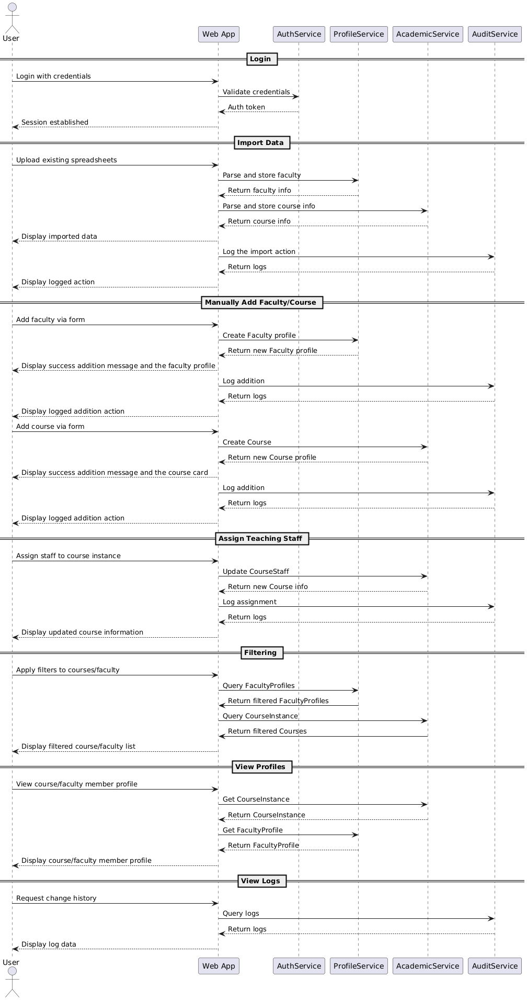
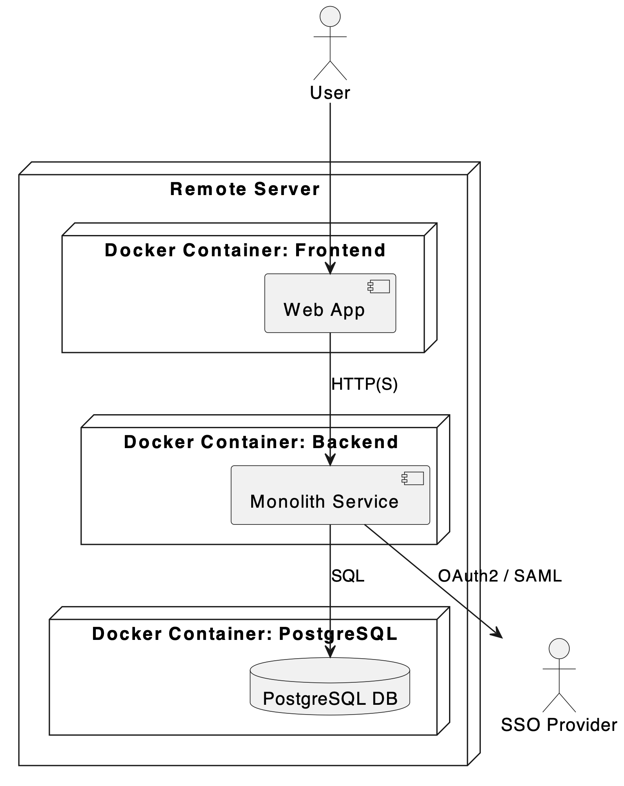

# 🎓 Faculty Allocation Helper

> A tool for simplifying the faculty allocation in Innopolis University

🔗 [Link to the deployed version](https://facallhelp.ru)
📹 [Demo video](https://www.youtube.com/watch?v=dQw4w9WgXcQ)

---

## 🎯 Project Goal and Description

Faculty Allocation Helper is a system designed to streamline faculty allocation across courses and programs. The client currently uses a large, complex spreadsheet to manage this process, involving multiple stakeholders such as hiring departments, course planners, and academic administrators. The goal is to replace this spreadsheet with a structured, user-friendly solution tailored to diverse user needs.

## 🧩 Project Context Diagram

Project context diagram with key stakeholders and external systems:

## 🗺️ Feature Roadmap

- [x] Registration/Authentication
- [x] Adding faculty
- [x] Data extraction from Excel tables
- [x] HTTP to HTTPS conversion
- [ ] Adding courses
- [ ] Authorization via SSO
- [ ] Information archive of previous years
- [ ] Varying functionality for different user types
- [ ] Workload calculation

## 📘 Usage Instructions / User Guide

Once you register or sign in, you appear at the home page of the website. Use the header navigation bar for switching to other pages.

If you click on the "Courses" section, a course list appears. You can click on the side menu to see course filtering options. You can add a new course or interact with the course cards. First of all, the course names are clickable and will lead toy to the course profile. Secondly, under "Teaching assistants" section of the course card, you can find the "Assign new" button and interact with the pop-up menu to assign either a new or an existing faculty member to a specific teaching position.

If you click on the "Facuty" section of the navigation bar, a faculty list appears. Here you can also open the side-menu for filtering options. You can all a new faculty member or see the existing faculty. If you click on the name of the employee, a pop-up window with their profile will appear.

If you click on the "Logs" section, the action log list will appear. 

If the user icon on the right of the navigation bar depicts the user profile, which is work in progress for now.

## 🔗 Accessing the Application

Follow the link: https://facallhelp.ru

To use the application, you should register or sign in.
1) To sign up use innopolis mail, e.g. m.pezer@innopolis.university
2) The password should be 9 or more symbols - Not necessarily the same as in your innopolis account
3) If you are already signed up in OUR web application - use existing mail and pass - it is checked by the system of authentication

---

## Architecture

### Static view

- UML Component Diagram: 
- [PlantUML source](docs/architecture/static-view/StaticView.puml)

Our system uses a monolith backend, separate frontend and an outer SSO. The database is accessed by backend. Communication between the services is implemented via HTTP calls. This approach simplifies the code navigation and decreases logic duplication.

### Dynamic view

- UML Sequence Diagram: 

This diagram shows interactions between different user types and services in our system.

### Deployment view

- UML Deployment Diagram: 
- [PlantUML source](docs/architecture/deployment-view/DeploymentUML.puml)

Simple containerization allows to quickly deploy or scale the frontend and backend on the same server. Using a single database simplifies data backup and migration.

## Development

### Kanban board

Link to our Kanban screenshot (updated daily): https://drive.google.com/file/d/1Oo3Lh--Dajjf32G4280qaKicAVV2Ycqy/view?usp=share_link

- **To do** - The task is assigned to a team member
- **In progress** - The work on a task is in progress
- **Done** - The result is accessible to the customer

### Git workflow

The chosen workflow is gitflow

- The issues are marked by the followwing lables: frontend, backend, UX/UI, devops
- Any issue can be assigned by any member at any moment
- The branches are created and named after each microservice, like authorization, parsing or profile service. There are also separate branches for frontend and backend generally
- Commits are made in free form by any member
-  Pull requests can be created by any member for the purposes of requesting changing the functionality
- Any member's code can be reviewed by another member
- Any member can merge pull requests for other members
- The issues are resolved by their assignees

#### Issue templates

[Bug report](issue_templates/Bug_Report.md)
[Technical Task](issue_templates/Technical_Task.md)
[User Story](issue_templates/User_Story.md)

#### Gitgraph diagram

[gitgrapgh](docs/development/git-workflow/gitgraph.png)

### Secrets management

So far, the secrets are transmitted manually when configuring the server. They are not stored in the repository.

## Build and deployment

### Continious integration

[The CI workflow file](fah-frontend/.gitlab-ci.yml)

[Link to where all CI workflow runs can be seen](https://gitlab.pg.innopolis.university/f.markin/fah/-/pipelines)

ESlint is included as a static analyzer but not launched

## Quality assurance

### User acceptance tests

[The user acceptance tests](docs/quality-assurance/user-acceptance-tests.md)

### Quality attribute scenarios

[The quality attribute scenarios](docs/quality-assurance/quality-attribute-scenarios.md)

### Automated testing

For unit testing, Jest was chosen as the main tool. It is widely
used for testing React applications, and Next.js which is based on React is well com-
patible with it. An extension for Jest was used for proper work with Next.js.

Beyond the standard testing package in Go, Ginkgo, GoConvey and Testify were con-
sidered. However, the Go standard package was chosen as the only one because it is
lightweight, fast, and tightly integrated with the Go toolchain (go test).

[The integration tests in the repo](FAH-auth-service/tests/integration)

[The unit tests in the repo](fah-frontend/__test__)
