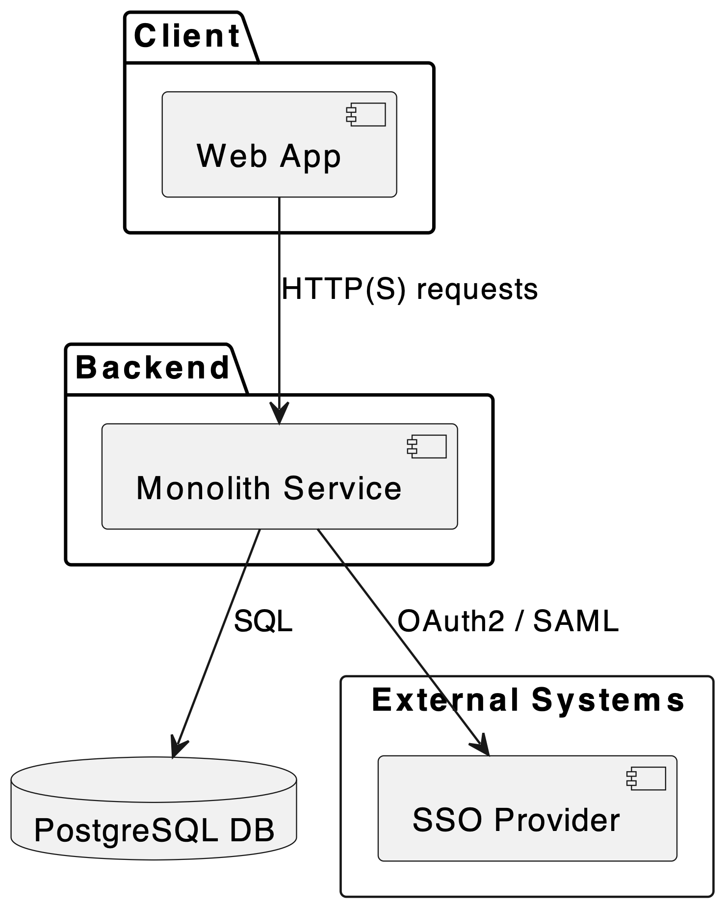

# Faculty Allocation Helper

## Usage

To test the application, you should register or sign in.
1) To sign up use innopolis mail, e.g. m.pezer@innopolis.university
2) The password should be 9 or more symbols - Not necessarily the same as in your innopolis account
3) If you are already signed up in OUR web application - use existing mail and pass - it is checked by the system of authentication

Once you register or sign in, you appear at the home page of the website. Use the header navigation bar for switching to other pages.

If you click on the "Courses" section, a course list appears. You can click on the side menu to see course filtering options. You can add a new course or interact with the course cards. First of all, the course names are clickable and will lead toy to the course profile. Secondly, under "Teaching assistants" section of the course card, you can find the "Assign new" button and interact with the pop-up menu to assign either a new or an existing faculty member to a specific teaching position.

If you click on the "Facuty" section of the navigation bar, a faculty list appears. Here you can also open the side-menu for filtering options. You can all a new faculty member or see the existing faculty. If you click on the name of the employee, a pop-up window with their profile will appear.

If you click on the "Logs" section, the action log list will appear. 

If the user icon on the right of the navigation bar depicts the user profile, which is work in progress for now.

## Architecture

### Static view

- UML Component Diagram: 
- [PlantUML source](docs/architecture/static-view/StaticView.puml)

The architecture is based on microservices. Each of them uses its own database. Communication between the services is implemented via HTTP calls. This approach simplifies testing and replacing separate components while making changes.

### Dynamic view

- UML Sequence Diagram: 

This diagram shows interactions between different user types and services in our system

### Deployment view

## Development

### Kanban board

Link to our Kanban screenshot (updated daily): [https://drive.google.com/file/d/1Oo3Lh--Dajjf32G4280qaKicAVV2Ycqy/view?usp=share_link]

- **To do** - [The task is assigned to somebody]
- **In progress** - [The work on a task is started]
- **Done** - [The task is completed]

### Git workflow

The chosen workflow is gitflow

- The issues are marked by the followwing lables: [frontend, backend, UX/UI, devops]
- Any issue can be assigned by any member at any moment
- The branches are created and named after each microservice, like authorization, parsing or profile service. There are also separate branches for frontend and backend generally
- Commits are made in free form by any member
-  Pull requests can be created by any member for the purposes of requesting changing the functionality
- Any member's code can be reviewed by another one
- Any member can merge pull requests for other members
- The issues are resolved by their assignees

#### Gitgraph diagram

[gitgrapgh](docs/development/git-workflow/gitgraph.png)

### Secrets management

So far, the secrets are transmitted manually when configuring the server. They are not stored in the repository and the main branch is protected.

### Automated testing

For unit testing, Jest was chosen as the main tool. It is widely
used for testing React applications, and Next.js which is based on React is well com-
patible with it. An extension for Jest was used for proper work with Next.js.

Beyond the standard testing package in Go, Ginkgo, GoConvey and Testify were con-
sidered. However, the Go standard package was chosen as the only one because it is
lightweight, fast, and tightly integrated with the Go toolchain (go test).

[The integration tests in the repo](FAH-auth-service/tests/integration)
[The unit tests in the repo](fah-frontend/__test__)

### Continious integration

[The CI workflow file](fah-frontend/.gitlab-ci.yml)
[Link to where all CI workflow runs can be seen](https://gitlab.pg.innopolis.university/f.markin/fah/-/pipelines)
ESlint is included as a static analyzer but not launched

## Quality

The quality characteristics are discussed with the customer

### Reliability

#### Recoverability

It is important to save the data somewhere so that it doesn't disappear in case of any error
### Flexibility

#### Adaptability

The product should be able to launch in any invironment.

### Performance efficiency

#### Capacity

Our product should have a limit to which the working process meets the requirements
